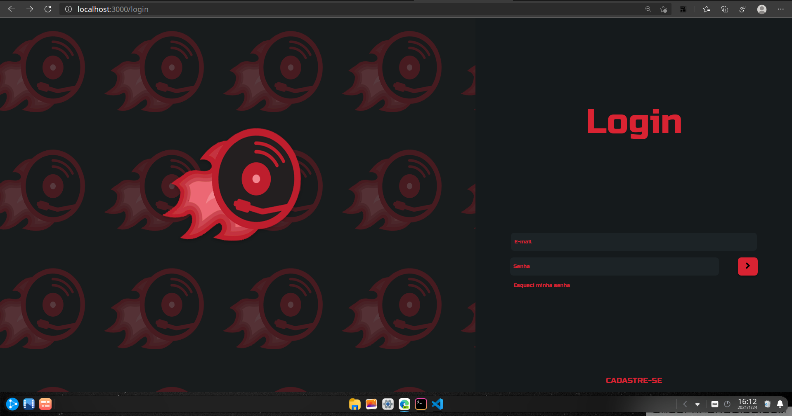

# Musicker

<!---Esses são exemplos. Veja https://shields.io para outras pessoas ou para personalizar este conjunto de escudos. Você pode querer incluir dependências, status do projeto e informações de licença aqui--->




> Esse é o meu projeto de tcc que foi feito em 2018 para a conclusão do meu curso de técnico em informática

### Ajustes e melhorias

O projeto ainda está em desenvolvimento e as próximas atualizações serão voltadas nas seguintes tarefas:

- [x] Criação do banco de dados e conexão com o mesmo 
- [x] Criação das rotas para o CRUD de usuários
- [x] Criação das rotas para o CRUD de Músicas
- [ ] Criação da integração entre o front e o backend
- [ ] Criação das funcionalidades de reprodução de músicas

## 💻 Pré-requisitos

Antes de começar, verifique se você atendeu aos seguintes requisitos:

* Você instalou a versão mais recente de `NodeJS`
* Você tem uma máquina `<Windows / Linux / Mac>`.

## 🚀 Instalando Musicker

Para instalar o <nome_do_projeto>, siga estas etapas:

Linux, MacOS e Windows:
```
//backend
git clone https://github.com/odevjunior/musicker.git
cd musicker/backend
npm install
npm run dev

//frontend
cd musicker/frontend
npm install
npm run start
```

Esse projeto está sob licença. Veja o arquivo [LICENÇA](LICENSE.md) para mais detalhes.

[⬆ Voltar ao topo](#nome-do-projeto)<br>
